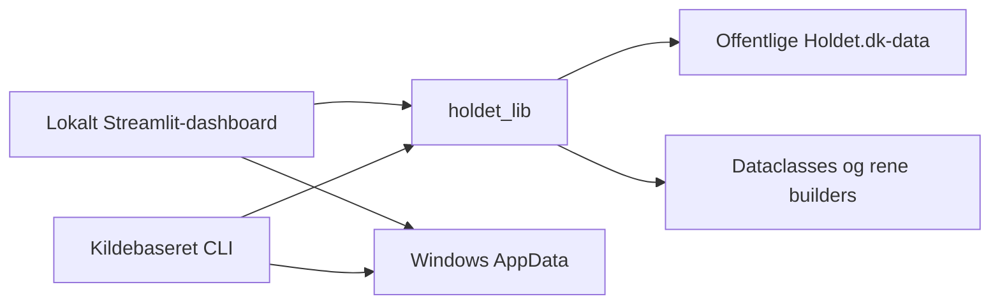

# Holdet Fantasy Hub


Holdet Fantasy Hub er et uofficielt, lokalt Windows-værktøj til offentlige fantasydata fra [Holdet.dk](https://www.holdet.dk/). Dashboardet samler managerspil, spillere, hold, grupper og turneringer uden login, cookies eller browserautomatisering.

> Projektet er ikke udviklet, godkendt eller supporteret af Holdet.dk.

## Hvad kan det?

- Brug Rundecenteret i hvert managerspil til runde, deadline, datafriskhed, manglende hold, statusskift og rangbevægelser.
- Sammenlign 2–5 spillere, gem en watchlist, se rundeændringer og følg pris-, vækst- og statushistorik.
- Undersøg holdhistorik og simulér transfers uden at ændre Holdet, snapshots eller konfiguration.
- Følg gruppestillinger, gruppehistorik og reproducerbare turneringer i en visuel bracket.
- Saml globale managerresultater i Hall of Fame med aliaser, redigerbar pointprofil, live-preview og frosne resultater.
- Se handlingsorienteret Datastatus og opret eller validér en komplet ZIP-backup under Data og lager.
- Eksportér spiller- og holddata som TXT, JSON og Markdown.

## Kom hurtigt i gang

Projektet kræver Windows og Python 3.14. Kør fra repositoryets rod i PowerShell:

```powershell
py -3.14 -m pip install -e ".[website,test]"
```

```powershell
py -3.14 -m streamlit run .\website\app.py
```

Åbn derefter [http://localhost:8501](http://localhost:8501). Data hentes kun, når du vælger en eksplicit hente- eller opdateringshandling. Navigation, historik, sammenligning og transfersimulation er cache-only.

## Navigation

Sidebaren samler **Mine managerspil**, **Tilføj managerspil**, de selvstændige **Spillerstatistik**- og **Holdstatistik**-sider, aktive og arkiverede managerspil, **Hall of Fame** samt **Data og lager**. Rundecenter er første fane inde i et managerspil; det vises ikke på forsiden.

Et managerspil har fanerne Rundecenter, Grupper, Spillerstatistik, Holdstatistik, Historik, Administration og Indstillinger. Valg kan deeplinkes med `view`, `section`, `panel`, `round`, `team` og `group`. De selvstændige statistikvisninger kræver et managerspilvalg; inde i et managerspil eller en gruppe genbruges den allerede valgte kontekst.

Læs den fulde navigation i [Klienter](docs/clients.md).

## Sådan hænger projektet sammen



Netværks- og parserlogik ligger i `holdet_lib`. Dashboardet og CLI'en vælger selv, hvornår modeller skal gemmes eller eksporteres. Se [Arkitektur](docs/architecture.md) for ansvarsgrænserne.

## Hvis port 8501 allerede er i brug

Kør kun én appinstans på port 8501. Hvis en gammel Streamlit-session viser kode, som ikke længere findes, skal du først identificere de konkrete processer:

```powershell
netstat -ano | Select-String ":8501"
```

```powershell
Get-CimInstance Win32_Process | Where-Object { $_.CommandLine -like "*streamlit*website\app.py*" } | Select-Object ProcessId, ParentProcessId, CommandLine
```

Stop kun de proces-ID'er, som både hører til denne app og det identificerede procestræ, og start derefter den normale kommando igen. Stop aldrig alle Python-processer bredt; andre programmer kan bruge Python. Et sundhedstjek kan køres med:

```powershell
Invoke-WebRequest http://127.0.0.1:8501/_stcore/health | Select-Object -ExpandProperty Content
```

## Dokumentation

| Emne | Dokument |
| --- | --- |
| Arkitektur og offentlige API'er | [Arkitektur](docs/architecture.md) |
| Dashboard, deeplinks og kildebaseret CLI | [Klienter](docs/clients.md) |
| Hentning fra Holdet.dk | [Datahentning](docs/data-retrieval.md) |
| AppData, snapshots, Hub-indstillinger og backup | [Datalagring](docs/data-storage.md) |
| Spillerliste, watchlist, sammenligning og ændringer | [Spillerstatistik](docs/player-statistics.md) |
| Hold, Transferlaboratorium og historik | [Holdstatistik](docs/team-statistics.md) |
| Gruppehistorik, bracket og Hall of Fame | [Grupper og turneringer](docs/groups-and-tournaments.md) |
| Pytest-strategi og kommandoer | [Tests](docs/testing.md) |

## Lokal data og privatliv

Personlige konti, grupper, Hub-indstillinger, snapshots, metadata, Hall of Fame-resultater, backups og eksporter gemmes uden for repositoryet under `%APPDATA%\Holdet Fantasy Hub` og `%LOCALAPPDATA%\Holdet Fantasy Hub`. Mapper oprettes først ved en eksplicit skrivehandling. Se [Datalagring](docs/data-storage.md) for stier, overrides, backup og sletning.

Repositoryet må ikke indeholde virkelige profil-ID'er, fantasy-team-ID'er eller personlige holdnavne. Dokumentation og tests bruger kun fiktive identiteter.

## Tests

```powershell
py -3.14 -m pytest tests -q
```

Live-kontroller er opt-in og er beskrevet i [Tests](docs/testing.md).

## Status

Versionen er `0.1.0`. Projektet er Windows-only og under aktiv udvikling. Holdets offentlige payloads kan ændre sig; inkompatible nødvendige felter giver en tydelig fejl frem for et delvist snapshot.