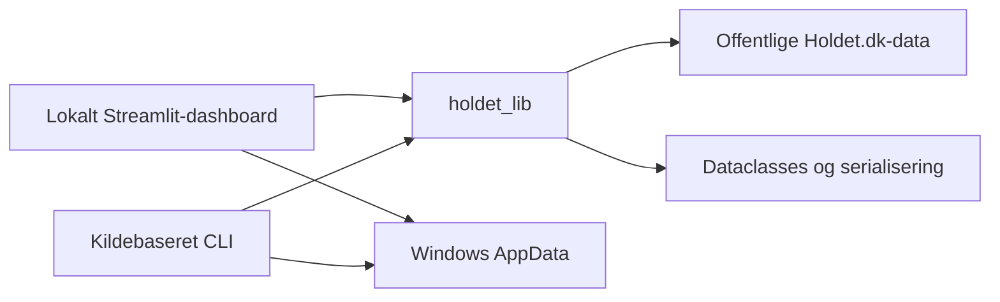

# Holdet Fantasy Hub


Holdet Fantasy Hub er et uofficielt, lokalt Windows-værktøj til offentlige fantasydata fra [Holdet.dk](https://www.holdet.dk/). Dashboardet samler managerspil, spiller- og holdstatistik, gruppestillinger og turneringer uden login, cookies eller browserautomatisering.

> Projektet er ikke udviklet, godkendt eller supporteret af Holdet.dk.

## Hvad kan det?

- Hent spillerstatistik og komplette fantasyhold på tværs af Holdets kendte spilformater.
- Se aktuelle og historiske runder med danske tal- og statusformater.
- Organisér hold i gruppestillinger eller reproducerbare knockoutturneringer.
- Eksportér spiller- og holddata som TXT, JSON og Markdown.
- Genbrug lokalt gemte snapshots uden automatisk netværkstrafik.

## Kom hurtigt i gang

Projektet kræver Windows og Python 3.14. Kør fra repositoryets rod i PowerShell:

```powershell
py -3.14 -m pip install -e ".[website]"
```

```powershell
py -3.14 -m streamlit run .\website\app.py
```

Åbn derefter [http://localhost:8501](http://localhost:8501). Data hentes kun, når du vælger en eksplicit hente- eller opdateringshandling i dashboardet.

## Sådan hænger projektet sammen



Netværks- og parserlogik ligger i `holdet_lib`. Dashboardet og CLI'en vælger selv, hvornår modeller skal gemmes eller eksporteres. Se [arkitekturen](docs/architecture.md) for ansvarsgrænserne.

## Dokumentation

| Emne | Dokument |
| --- | --- |
| Arkitektur og offentlige API'er | [Arkitektur](docs/architecture.md) |
| Dashboard og kildebaseret CLI | [Klienter](docs/clients.md) |
| Hentning fra Holdet.dk | [Datahentning](docs/data-retrieval.md) |
| AppData, snapshots og konfiguration | [Datalagring](docs/data-storage.md) |
| Filtre og spillereksport | [Spillerstatistik](docs/player-statistics.md) |
| Hold, historik og teameksport | [Holdstatistik](docs/team-statistics.md) |
| Gruppestillinger og turneringer | [Grupper og turneringer](docs/groups-and-tournaments.md) |
| Teststrategi og kommandoer | [Tests](docs/testing.md) |

## Lokal data og privatliv

Personlige konti, grupper, snapshots og eksporter gemmes uden for repositoryet under `%APPDATA%\Holdet Fantasy Hub` og `%LOCALAPPDATA%\Holdet Fantasy Hub`. Mapper oprettes først ved en eksplicit skrivehandling. Se [Datalagring](docs/data-storage.md) for stier, overrides og sletning.

Repositoryet må ikke indeholde virkelige profil-ID'er, fantasy-team-ID'er eller personlige holdnavne. Dokumentation og tests bruger kun fiktive identiteter.

## Tests

```powershell
py -3.14 -m unittest discover -s tests -v
```

Live-kontroller er opt-in og er beskrevet i [testdokumentationen](docs/testing.md).

## Status

Versionen er `0.1.0`. Projektet er Windows-only og under aktiv udvikling. Holdets offentlige payloads kan ændre sig; inkompatible nødvendige felter giver en tydelig fejl frem for et delvist snapshot.
