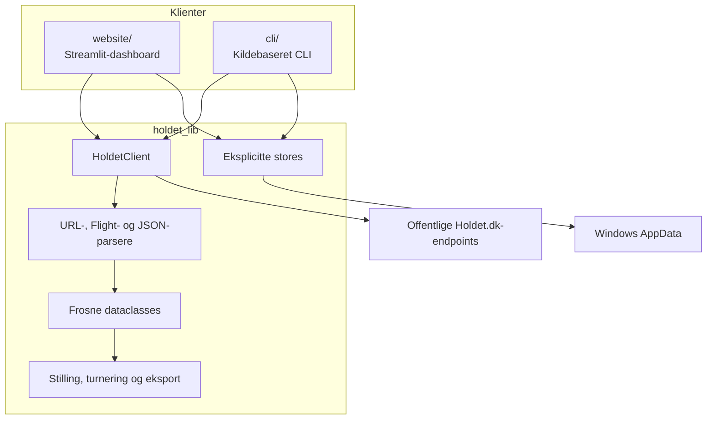
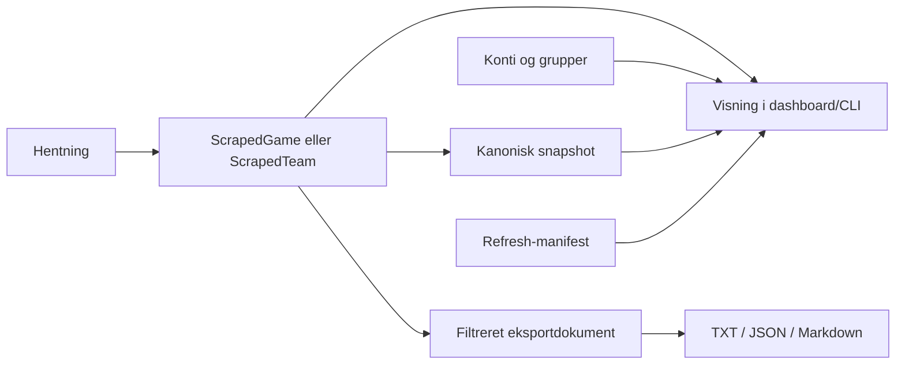

# Arkitektur

Holdet Fantasy Hub består af et importerbart bibliotek og to klienter. Biblioteket ejer domænemodeller, netværk, parsing og serialisering. Klienterne beslutter, hvornår data skal hentes, vises eller gemmes.

## Systemoverblik



Afhængigheden går ind mod `holdet_lib`; biblioteket importerer ikke dashboardet eller CLI'en. Det gør parser- og beregningslogik testbar uden Streamlit eller en rigtig netværksforbindelse.

## Lag og ansvar

### `holdet_lib`

Biblioteket indeholder:

- `HoldetClient`, som returnerer domænemodeller for spillere, hold, kontoopdagelse og spilmetadata.
- `HttpClient`, URL-normalisering og parsere til server-renderet Flight-data og JSON-endpoints.
- Dataclasses som `GameUrl`, `ScrapedGame`, `ScrapedTeam`, `RoundSummary` og `PlayerEntry`.
- Rene beregninger for filtrering, gruppestillinger, turneringer, H2H og eksportdokumenter.
- Stores til konfiguration, snapshots, manifester, revisioner og brugerrettede eksporter.

Et almindeligt klientkald skriver ikke filer:

```python
from holdet_lib import HoldetClient

client = HoldetClient()
players = client.fetch_players(
    "https://www.holdet.dk/da/fantasy/super-manager-fall-2026"
)
team = client.fetch_team(
    "https://www.holdet.dk/da/fantasy/super-manager-fall-2026/fantasyteams/900000000001"
)
```

### `website`

Streamlit-klienten styrer navigation og session state. Den læser cache ved opstart, men henter kun fra Holdet efter et eksplicit klik. Når brugeren henter eller eksporterer, kalder klienten biblioteket og den relevante store.

### `cli`

CLI'en er en tynd argument- og batchklient omkring de samme modeller og stores. Dokumentationen bruger kildekørslen `py -3.14 .\cli\main.py`; se [Klienter](clients.md).

## Dataejerskab



- Domænemodellen er sandhedskilden for én hentning.
- Snapshots er komplette, uforanderlige lokale kopier til senere offlinevisning.
- Eksporter er brugerrettede afledninger og må ikke bruges som kanonisk cache.
- Manifester beskriver resultatet af en eksplicit gruppe- eller managerspilopdatering.
- Konfiguration gemmer brugerens konti, managerspil, grupper og turneringsplaner.

## Offentlige hovedinterfaces

| Interface | Formål |
| --- | --- |
| `HoldetClient` | Hent spillere, hold, kontoens hold og spilmetadata som modeller |
| `AccountStore` | Administrér den lokale kontokonfiguration |
| `GroupStore` | Administrér managerspil, grupper og turneringsrevisioner |
| `SnapshotStore` | Gem og indeksér kanoniske teamsnapshots |
| `PlayerStatisticsStore` | Gem og indeksér komplette spillersnapshots |
| `ManifestStore` | Gem uforanderlige refresh-manifester |
| `PlayerExportStore` / `TeamExportStore` | Gem valgte eksportformater atomisk |
| `resolve_paths()` | Find effektive AppData-stier uden at oprette mapper |

## Designregler

1. Import og stiresolution må ikke oprette mapper eller kontakte Holdet.
2. Parsere og beregninger holdes rene og får data injiceret.
3. Netværksfejl må ikke overskrive en gyldig cache.
4. Uforenelige nødvendige payloadfelter giver fejl frem for delvise snapshots.
5. Produktversion og lokale schema-versioner udvikles uafhængigt.
