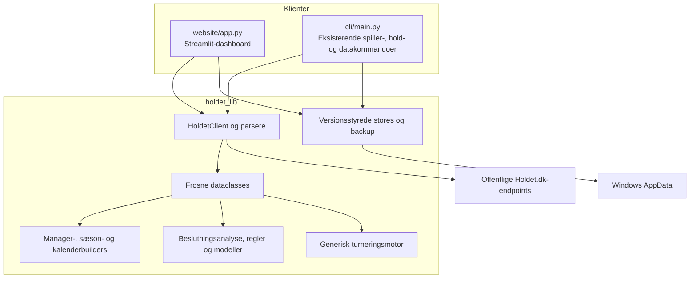
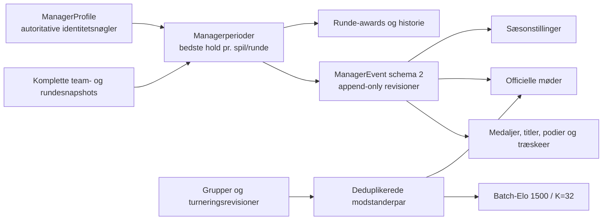
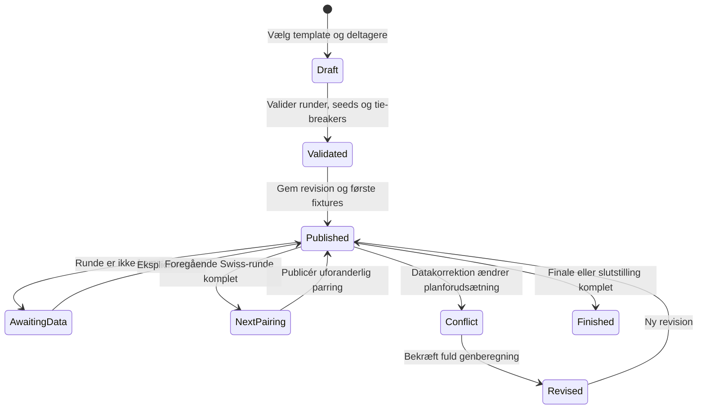

# Arkitektur

Holdet Fantasy Hub har et importerbart domænebibliotek, et lokalt Streamlit-dashboard og en kildebaseret CLI. Manager-, sæson-, kalender- og turneringsændringerne er kun koblet til biblioteket og Streamlit; CLI'en har ikke fået nye kommandoer.

## Systemgrænser

Afhængigheden går ind mod biblioteket. `holdet_lib` importerer ikke Streamlit. Navigation, Elo, H2H, historier, sæsonstillinger, kalender og beslutningsanalyse kan derfor beregnes uden netværk og uden vedvarende writes.

## Lag og ansvar

### Biblioteket

`holdet_lib` ejer:

- URL-normalisering, HTTP-klient, Flight-/JSON-parsere og Holdet-modeller;
- snapshot-, metadata-, diff-, historik- og transferberegninger;
- sæsonbundne `GameRuleProfile`-kontrakter, statusalarmer, spiller-/hold-/gruppeanalyse, idealhold og Monte Carlo;
- managerprofiler, eventrevisioner, Elo, karrierestatistik, awards, historier og H2H;
- sæsondefinitioner og pointprofilbaserede sæsonstillinger;
- liga-, Swiss-, gruppe+knockout- og double-elimination-definitioner;
- pairing-, konfigurations-, snapshot-, metadata-, manifest- og backupstores.

Rene builders skriver ikke filer. Stores skriver kun efter eksplicitte handlinger.

### Streamlit

`website/app.py` ejer routing og eksplicitte refresh-hooks. `website/hub_pages.py` ejer Managers, Kalender, Rundens historie og relaterede paneler. `website/analysis_pages.py` ejer Analyse-panelerne, spillerdetaljer og alarmindbakken. Query-parametre og navngivet session state fastholder kontekst. Almindelig navigation læser cache.

### CLI

CLI'en genbruger fortsat biblioteket til spiller-, hold-, eksport- og datakommandoer. Den har ingen manager-, sæson-, kalender- eller turneringsformatkommandoer.

## Manager-eventflow

`owner_user_id` har første prioritet, derefter `account_user_id` eller en autoritativ kontonøgle. Den deterministiske identitetsgraf forbinder samtidigt observerede autoritative nøgler; navn er kun fallback eller del af en eksplicit manuel profil. Samme manager reduceres til det bedste hold i en ratingperiode, og selvopgør fjernes. Flergruppeturneringer opretter kun modstanderpar inden for den faktiske pulje.

Eventledgeren er revisionsstyret. En rettelse publiceres som en højere revision med `supersedes_revision`; læsning vælger den seneste revision og remapper placements gennem den aktuelle identitetsgraf uden writes. `ManagerEvent` og kompatibilitetsnavnet `HallOfFameEvent` repræsenterer samme schema-2 in-memory-værdi. Schema-1 Hall of Fame-events indlæses som legacy-revision 1.

## Turneringslivscyklus

Seeds fryses ved oprettelse. Schema 8 bruger fortsat `TournamentConfig` som runtimeformat og `TournamentDefinition` som kompatibelt alias; templateklasserne er validerede projektioner. Publicerede parringer ændres ikke af senere Elo- eller datakorrektioner. Den rene konfliktbuilder sammenligner dem med parringer udledt af korrigerede resultater. Format, deltagere, seeding, tie-breakers eller rundestruktur kræver en ny revision; navn og officiel URL er kosmetiske ændringer.

## Dataejerskab

- `SnapshotIndex` er læseindekset for uforanderlige snapshots.
- `HubSettings` schema 3 ejer watchlist, `ManagerProfile`, spillerannotationer, gemte filterprofiler, standardhold, eksperimentelt opt-in og den globale pointprofil.
- `analysis-inbox.json` schema 1 ejer deduplikerede statusalarmer og deres læst-/afvisttilstand.
- `groups.json` schema 8 ejer managerspil, grupper, officielle links og `TournamentDefinition`.
- `seasons.json` schema 1 ejer manuelle sæsondefinitioner.
- pairing-store schema 1 ejer publicerede parringer pr. turneringsrevision.
- eventledger schema 2 ejer rå managerresultater og revisioner.
- `GameMetadata` schema 2 ejer schedule, deadlines og en fail-closed sæsonregelprojektion, som kalender og analyser læser uden fetch.
- Fixturecache schema 1 ejer kun offentligt verificerede, parsertestede kampe; difficulty kræver særskilt feltdokumentation.

Se [Datalagring](data-storage.md) for konkrete stier og kompatibilitetsregler.

## Offentlige hovedinterfaces

| Område | Interfaces |
| --- | --- |
| Hentning | `HoldetClient`, `GameUrl`, `ScrapedGame`, `ScrapedTeam`, `RoundStatus` |
| Identitet | `ManagerProfile`, `HubSettings`, `HubSettingsStore`, `build_effective_manager_settings`, `manager_identity_keys`, `resolve_manager_identity` |
| Manageranalyse | `ManagerEvent`, `ManagerRating`, `ManagerCareer`, `ManagerHeadToHead`, `RoundAward`, `RoundStory`, `build_hall_of_fame` |
| Sæson | `SeasonDefinition`, `SeasonStanding`, `SeasonStore`, `build_season_standings` |
| Kalender | `CalendarEvent`, `build_calendar_events` |
| Turnering | `TournamentDefinition`, `TournamentConfig`, `TournamentTemplateConfig`, templatekonfigurationer, `tournament_template_config`, `create_tournament_definition`, `build_tournament_state` |
| Pairings | `TournamentPairing`, `TournamentPairingRevision`, `TournamentPairingStore`, `validate_tournament_pairing_revision`, `build_swiss_pairing_conflicts` |
| Historik | `compare_snapshots`, `compare_round_snapshots`, `build_history_series` |
| Transfer | `TransferScenario`, `simulate_transfers` |
| Beslutningsanalyse | `GameRuleProfile`, `AnalysisProvenance`, `build_player_decision_analysis`, `build_team_decision_ledger`, `build_group_comparison`, `build_group_exposure` |
| Idealhold og model | `optimize_ideal_team`, `simulate_transfer_scenario` |
| Alarmer og fixtures | `AnalysisInboxStore`, `build_watchlist_alerts`, `FixtureRecord`, `FixtureStore`, `parse_fixture_records` |
| Datastatus | `DataQualityReport`, `build_data_quality_report` |
| Backup | `create_backup`, `validate_backup`, `restore_backup` |

Legacy-navnene `HallOfFameEvent`, `create_tournament_config` og `build_tournament_state` er bevaret. De dokumenterede top-level-navne eksporteres via `holdet_lib.__all__`.

## Designregler

1. Import og `resolve_paths()` må ikke oprette mapper eller kontakte Holdet.
2. Navigation, Managers, Kalender, H2H, grafer og simulation er cache-only.
3. Netværksfejl må ikke overskrive gyldig cache.
4. Nye stores er additive; manglende filer er tomme, og startup omskriver ikke ældre data.
5. Stable ID'er er sidste deterministiske fallback i builders.
6. Produktversion `0.1.0` og lokale schema-versioner udvikles uafhængigt.

Se [Analyse- og beslutningscenter](decision-analysis.md) for formelkontrakter, provenance, modelgates og evidensmatrix.
