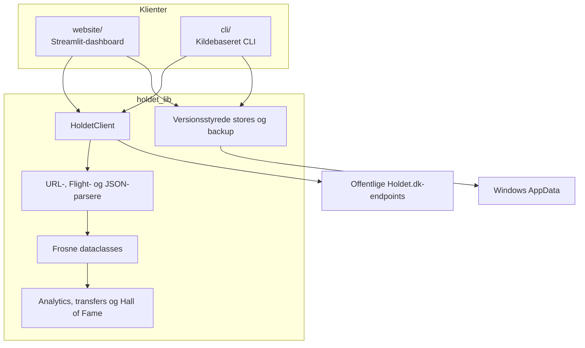
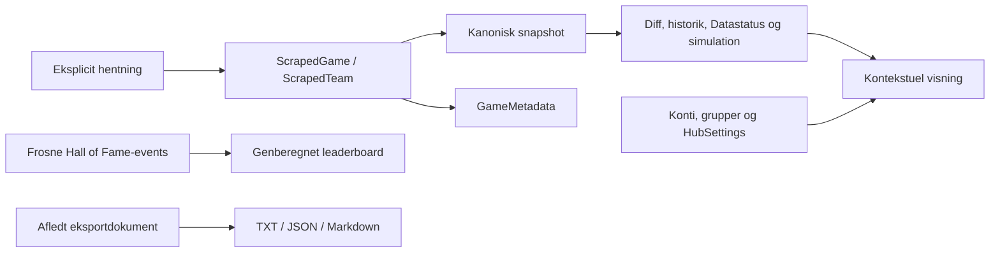

# Arkitektur

Holdet Fantasy Hub består af et importerbart bibliotek og to klienter. `holdet_lib` ejer domænemodeller, netværk, parsing, beregninger og serialisering. Streamlit-dashboardet og CLI'en beslutter, hvornår data skal hentes, vises eller gemmes.

## Systemoverblik

Afhængigheden går ind mod biblioteket. `holdet_lib` importerer ikke Streamlit-routes, så parsere, round-aware diffing, historik, transfers, Hall of Fame, Datastatus og backup kan testes uden UI eller netværk. Datastatus-links bygges i website-laget fra locale og slug.

## Lag og ansvar

### `holdet_lib`

Biblioteket indeholder:

- `HoldetClient`, URL-normalisering og parsere til server-renderet Flight-data og JSON-endpoints.
- Frosne modeller for spil, spillere, hold, runder, metadata, diffing, historik, transfers, Datastatus, Hall of Fame og backup.
- Rene builders som `compare_snapshots`, `compare_round_snapshots`, `compare_team_snapshots`, `build_history_series`, `build_player_history`, `simulate_transfers`, `build_hall_of_fame` og `build_data_quality_report`.
- Eksplicitte stores til konfiguration, Hub-indstillinger, snapshots, metadata, manifester, turneringsrevisioner og frosne Hall of Fame-events.
- Valideret ZIP-backup med `create_backup`, `validate_backup` og `restore_backup`.

Et almindeligt klient- eller builderkald skriver ikke filer. Kun stores og eksplicitte backup-/eksportfunktioner gør det.

### `website`

`website/app.py` er entrypoint og router. Paneler er kontekstuelle og lazy-loadede; query-parametre og navngivet session state fastholder spil, gruppe, hold og runde. UI'et læser cache ved navigation og foretager kun netværk eller vedvarende writes efter et eksplicit klik. Transferlaboratoriets scenarier lever kun i session state.

### `cli`

CLI'en er en tynd argument- og batchklient omkring de samme hente-, snapshot- og eksportinterfaces. Dokumentationen bruger kildekørslen `py -3.14 .\cli\main.py`; se [Klienter](clients.md).

## Dataejerskab

- Snapshots er komplette, uforanderlige lokale kopier til offlinevisning.
- `GameMetadata` gemmer schedule, deadline, format og hentetid efter eksplicitte fetches.
- `HubSettings` gemmer watchlist, manageraliaser og den redigerbare pointprofil atomisk.
- Hall of Fame-ledgeren gemmer frosne råresultater; pointprofilen genberegner visningen uden at ændre dem.
- Manifester beskriver resultater af eksplicitte opdateringer.
- Eksporter er brugerrettede afledninger og indgår ikke i en Hub-backup.

## Offentlige hovedinterfaces

| Område | Interfaces |
| --- | --- |
| Hentning | `HoldetClient`, `GameUrl`, `ScrapedGame`, `ScrapedTeam`, `RoundStatus` |
| Konfiguration | `AccountStore`, `GroupStore`, `HubSettings`, `HubSettingsStore`, `ManagerAlias`, `WatchlistEntry` |
| Metadata | `GameMetadata`, `GameMetadataStore`, `game_metadata_from_context` |
| Snapshots | `SnapshotStore`, `PlayerStatisticsStore`, `ManifestStore` |
| Diff og historik | `SnapshotDiff`, `TeamSnapshotDiff`, `HistoryPoint`, `PlayerHistoryPoint`, `compare_round_snapshots`, `compare_team_rounds`, `build_history_series` |
| Transfer | `TransferRuleProfile`, `TransferScenario`, `TransferValidation`, `FOOTBALL_RULES`, `CYCLING_RULES`, `MOTOR_RULES`, `GOLF_RULES`, `simulate_transfers` |
| Hall of Fame | `HallOfFameEvent`, `HallOfFameScoreProfile`, `HallOfFameStore`, `build_hall_of_fame`, `build_live_hall_of_fame_events` |
| Datastatus | `DataQualityRound`, `DataQualityReport`, `build_data_quality_report` |
| Backup | `BackupManifest`, `BackupValidation`, `RestoreResult`, `create_backup`, `validate_backup`, `restore_backup` |
| Eksport | `PlayerExportStore`, `TeamExportStore`, `build_player_export`, `build_team_export` |
| Stier | `AppPaths`, `PathOverrides`, `resolve_paths()` |

De dokumenterede top-level-navne eksporteres via `holdet_lib.__all__`, og type hints på de offentlige modeller skal kunne evalueres med `typing.get_type_hints()`.

## Designregler

1. Import og `resolve_paths()` må ikke oprette mapper eller kontakte Holdet.
2. Navigation, grafer, sammenligning og simulation er cache-only.
3. Parsere og beregninger holdes rene og får data injiceret.
4. Netværksfejl må ikke overskrive en gyldig cache.
5. Uforenelige nødvendige payloadfelter giver fejl frem for delvise snapshots.
6. Nye stores er additive; manglende filer behandles som tomme, og ældre data omskrives ikke ved opstart.
7. Produktversion `0.1.0` og lokale schema-versioner udvikles uafhængigt.