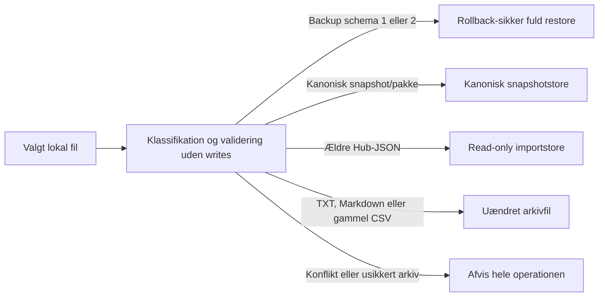

# Dataportabilitet og integritet

Hubben skelner mellem kanoniske data, afledte filer og ikke-gendannelige supportpakker. Almindelig opstart og navigation læser kun; eksport, backup, import, indeksreparation, arkivering og sletning kræver hver sin eksplicitte handling under **Data og lager**.

## Fælles datakontrakt

`DataPackage` schema 1 samler dokumenttype, scope, et tidszonebevidst ISO-8601-tidspunkt, provenance og en eller flere navngivne `DataTable`-tabeller. Rækker indeholder rå tekst-, heltals-, decimal-, boolske eller tomme værdier. Spiller-, hold-, manager-, sæson- og rapportprojektioner bruger denne kontrakt til maskinlæsbare formater.

| Format | Kontrakt |
| --- | --- |
| CSV | RFC 4180, CRLF og UTF-8 med BOM. En tabel giver én CSV; flere tabeller giver ZIP med `manifest.json`. |
| XLSX | `xlsxwriter`, ét ark pr. tabel. Formel-, URL- og talfortolkning af tekst er slået fra. |
| Parquet | Valgfri `holdet-lib[parquet]`-ekstraafhængighed med PyArrow. Flere tabeller giver ZIP. |
| TXT/JSON/Markdown | Eksisterende bytes, standardvalg og dokumentstruktur er bevaret. |

Tekst der kan starte en regnearksformel (`=`, `+`, `-`, `@`, tab eller carriage return) får en indledende apostrof i CSV/XLSX. JSON og Parquet bevarer den oprindelige tekst, og numeriske værdier forbliver numeriske.

## Rapporter og anonymisering

Managerspilrapporten indeholder dataproveniens, rundestatus, hold, grupper/turneringer, stillinger og rundehistorik. Sæsonrapporten indeholder konkurrencer, samlet managerstilling, pointsammensætning, medaljer og provenance. HTML er autoritativ: én escaped fil med indlejret CSS, skærm- og A4-printlayout, ingen JavaScript og ingen eksterne assets. Brug browserens **Udskriv → Gem som PDF** for PDF.

Supportpakker har `support-manifest.json`, SHA-256 for indholdet, `restorable: false` og ingen pseudonymmapping:

- `share` erstatter konto-, manager-, fantasyhold- og brugeridentiteter med stabile pseudonymer inden for pakken. Offentlige sportsmålinger bevares.
- `debug` minimerer yderligere og fjerner lokale stier, URL'er, noter, tags, fritekst og genkendelige labels.

## Importregler

Identiske SHA-256-værdier springes over. En identitetskollision med andet indhold afviser operationen før første write. Ældre JSON blandes aldrig ind i analyser, og tekst/Markdown/CSV parses ikke til domænedata. En anonymiseret supportpakke kan arkiveres, men aldrig gendannes.

ZIP-validering afviser traversal, backslashes, absolutte stier, dubletter, mapper, symlinks, for mange medlemmer, for store enkeltfiler eller totaler, for stort manifest og mistænkelig kompressionsratio.

## Integritetsindeks

`data/integrity-index.json` schema 1 er afledt og aldrig sandhedskilden. Hver post har relativ sti, type, spilscope, størrelse, `mtime_ns`, kendt schema-version og SHA-256.

- Hurtig kontrol sammenligner eksistens, størrelse, ændringstid og kendte JSON-schemas.
- Fuld kontrol streamer SHA-256 og parser alle kanoniske JSON-filer.
- **Reparer indeks** viser tilføjede, ændrede og fjernede poster og erstatter kun indeksfilen atomisk. Korrupte data ændres eller skjules ikke.

## Lager, retention og oprydning

Lagerinventaret viser eksakte bytes og filantal pr. managerspil samt **Fælles** for globale data. Kategorierne er aktive snapshots, manifester/revisioner, importerede data, afledte eksporter, backups og arkiver.

Retention vælger deterministisk kun ældre, gyldige versioner:

- nyeste spillersnapshot bevares pr. `(locale, spil, runde)`;
- nyeste teamsnapshot bevares pr. `(locale, spil, hold, runde)`;
- korrupte eller uklassificerbare filer vælges aldrig automatisk.

Arkivering skriver de oprindelige relative stier og checksums til en midlertidig ZIP, validerer hele arkivet og publicerer det atomisk. Først derefter forsøges kilderne fjernet. Manuel sletning er begrænset til valgte afledte eksporter, rapporter, gamle backups og eksisterende mellemversionsarkiver; den nyeste backup, konfiguration, revisioner, manifester og aktive snapshots er ikke tilladte mål.

## Sportsadaptere

Det interne registry har indbyggede `SportAdapter`-objekter for fodbold, cykling, Formel 1 og golf. Adaptere ejer rute-/formatmapping, labels, positionsnormalisering, præsentation og sportskapabiliteter. `GameRuleProfile` er fortsat den sæsonspecifikke regelautoritet. Adapterdefaults er altid `unverified`, og format- eller slugmatches kan ikke give en grøn regelgodkendelse.

Der indlæses ingen tredjeparts-entry-points eller dynamisk Python-kode. De eksisterende top-level-konstanter og hjælpefunktioner er kompatibilitetsfacader.
