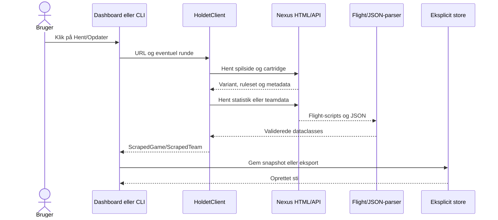

# Datahentning fra Holdet.dk

Biblioteket henter offentligt server-renderet HTML og JSON fra Holdet.dk. Det bruger ikke login, cookies, Selenium, browser-scrolling eller skjulte browserprofiler.

## Fra URL til model



### 1. URL-normalisering

En spiladresse normaliseres til locale og slug fra:

```text
https://www.holdet.dk/<locale>/fantasy/<slug>/...
```

En bar slug i dashboardet bruger locale `da`. Ukendte hosts og ugyldige stier afvises, før der foretages en netværksanmodning.

### 2. Variant og spilpolitik

Den offentlige Nexus-rod er:

```text
https://nexus-app-fantasy.holdet.dk/<locale>/<slug>
```

Her findes den rå route-variant. Cartridge-data fra `/api/cartridges/<slug>` leverer ruleset og metadata. Biblioteket skelner mellem:

- route-varianten, som bruges til Nexus-URL'er;
- det normaliserede format `soccer`, `cycling`, `formula1` eller `golf`;
- enheden `money` eller `points`.

`salaryCap > 0` betyder penge, mens `salaryCap = 0` betyder point. Det er vigtigt for cykling, hvor Tourspillet og Tour Manager kan bruge samme format, men forskellige enheder. Den ældre variant `cycling_world_tour` behandles som cykling.

### 3. Spillerstatistik

Statistiksiden hentes fra:

```text
/<locale>/<slug>/<route-variant>/statistics[?round=<runde>]
```

Next.js Flight-strenge samles fra sidens scripts. Parseren finder den gyldige `rows`-liste og dens tilhørende runde og bygger `PlayerEntry`-modeller med navn, hold/land, position/kategori, pris/point, vækst og statusfelter. Hele serverpayloaden bruges, så den virtualiserede tabels synlige rækkeantal er irrelevant.

### 4. Fantasyhold og historik

En teamhentning kombinerer:

- den server-renderede fantasyteam-side for aktuelt overblik og opstilling;
- `/api/fantasyteams/<id>/history` for rundesammendrag;
- standardligaens overall- og runde-leaderboards, når de er offentligt tilgængelige;
- cartridge-data for format, enhed, salary cap og schedule-ID.

`/api/schedules/<schedule-id>` bruges til den autoritative finalerunde. For pengebaserede spil kontrolleres opstillingens samlede spillerværdi mod historikkens total minus bank; uoverensstemmelse genhentes én gang og giver derefter fejl.

## HTTP, retries og proxy

`HttpClient` bruger et beskrivende user-agent, en afgrænset timeout og genforsøg:

- Transiente HTTP-statusser, timeouts og almindelige netværksfejl får op til tre samlede forsøg.
- Aktivt afviste forbindelser får op til fem samlede forsøg med eksponentiel ventetid.
- Permanente 4xx-fejl og inkompatible payloads forsøges ikke unødigt igen.
- Windows- og miljøkonfigurerede proxyer respekteres og omgås aldrig automatisk.
- Proxy-credentials skjules i tekniske fejlbeskeder.

Dashboardet bevarer en gyldig cache ved fejl og tilbyder et eksplicit retry. Navigation alene foretager aldrig automatiske genforsøg.

## Fejlprincipper

Nødvendige felter valideres strengt. En tom spillerliste, manglende runde, ukendt format eller uforenelig historik giver en konkret fejl, og der skrives ikke et delvist snapshot. Valgfrie felter som visse offentlige rangeringer kan være `None`.

## Kendte begrænsninger

- Holdets offentlige payloads og endpoints kan ændre struktur.
- Historiske rundesammendrag findes, men projektet undersøger ikke et særskilt endpoint til historiske opstillinger.
- En historisk opstilling vises kun, hvis et kanonisk snapshot blev gemt i præcis den runde.
- Manglende værdier, top-procenter eller resultater estimeres aldrig.
- Der er ingen baggrundspolling, scheduler eller automatisk opdatering.
