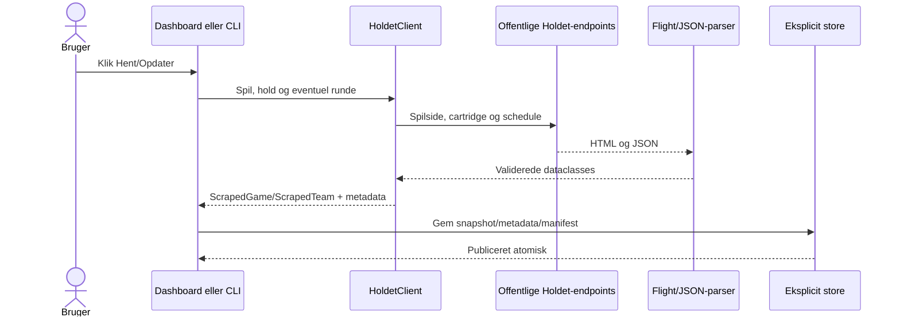

# Datahentning fra Holdet.dk

Biblioteket henter offentligt server-renderet HTML og JSON fra Holdet.dk. Det bruger ikke login, cookies, Selenium, browser-scrolling eller skjulte browserprofiler.

## Fra klik til cache



Navigation, Rundecenter, Managers, H2H, sæsoner, Kalender, Datastatus, historik, watchlist, sammenligning, ændringer og Transferlaboratorium stopper før første netværkspil. De bruger kun eksisterende snapshots, publicerede parringer og metadata. Manglende metadata vises som en datamangel og udløser aldrig automatisk kontakt til Holdet.

## URL, variant og spilpolitik

En spiladresse normaliseres til locale og slug fra:

```text
https://www.holdet.dk/<locale>/fantasy/<slug>/...
```

En bar slug bruger locale `da`. Ukendte hosts og ugyldige stier afvises før en netværksanmodning. Den offentlige Nexus-rod er `https://nexus-app-fantasy.holdet.dk/<locale>/<slug>`.

Cartridge-data leverer ruleset og metadata. Biblioteket skelner mellem rå route-variant, normaliseret format (`soccer`, `cycling`, `formula1`, `golf`) og enhed (`money`, `points`). `salaryCap > 0` betyder penge; `salaryCap = 0` betyder point. Det er nødvendigt for cykling, hvor route-navnet alene ikke afgør enheden.

## Spillerstatistik

Statistiksiden hentes fra:

```text
/<locale>/<slug>/<route-variant>/statistics[?round=<runde>]
```

Next.js Flight-strenge samles fra scripts, og parseren finder den gyldige `rows`-liste og runde. Hele serverpayloaden bruges uanset den virtualiserede tabels synlige rækker. Et eksplicit spiller-refresh gemmer både det komplette spillersnapshot og de tilgængelige spilmetadata.

Round-aware ændringer sammenligner bagefter de seneste lokale hentninger i valgt og foregående tilgængelige runde; selve sammenligningen foretager ingen ny hentning.

## Fantasyhold, historik og schedule

En teamhentning kombinerer fantasyteam-siden, `/api/fantasyteams/<id>/history`, offentlige samlede lister og rundelister samt cartridge-data. `/api/schedules/<schedule-id>` hentes sammen med manuelle spiller- og holdhentninger.

Schedule-parseren gemmer hver rundes `start`, `close` og `end`. Sluttid og hentetid afgør, om en sammenligning eller transfersimulation kan kaldes `final`, mens snapshotstatus er `complete`, `in_progress` eller `unknown`. Hvis schedulekaldet fejler, gemmes øvrige gyldige data med `unknown` og UI'et markerer grundlaget som foreløbigt.

For pengebaserede spil kontrolleres opstillingens værdi mod historikkens total minus bank. Uoverensstemmelse genhentes én gang og giver derefter fejl.

## Manuelle opdateringer og eventrevisioner

Kun eksplicitte manager-, spiller-, hold-, gruppe- og turneringshandlinger skriver nye snapshots eller metadata. En komplet slutrunde-refresh, arkivering eller **Genopbyg historik fra cache** kan desuden publicere manager-events.

Et komplet resultat er append-only. Hvis kildedata rettes, gemmes en højere eventrevision med reference til den supersedede revision; den gamle payload overskrives ikke. Schema-1 Hall of Fame-events læses som legacy-revisioner og remappes gennem de aktuelle managerprofiler.

Almindelig navigation beregner kun Elo, awards, historier, H2H, sæsonstillinger og kalender-events som previews. Ufuldstændige runder markeres foreløbige og fryses ikke. Swiss-parringer publiceres først efter en eksplicit refresh, som har gjort den foregående runde komplet.

## HTTP, retries og proxy

`HttpClient` bruger user-agent, afgrænset timeout og kontrollerede retries:

- transiente HTTP-statusser, timeouts og netværksfejl får op til tre samlede forsøg;
- aktivt afviste forbindelser får op til fem med eksponentiel ventetid;
- permanente 4xx-fejl og inkompatible payloads genforsøges ikke unødigt;
- Windows- og miljøproxyer respekteres;
- proxy-credentials skjules i tekniske fejl.

Ved fejl bevarer dashboardet en gyldig cache og tilbyder et eksplicit retry. Navigation starter aldrig automatiske genforsøg.

## Fejlprincipper og begrænsninger

Nødvendige felter valideres strengt. Tom spillerliste, manglende runde, ukendt format eller uforenelig historik giver en konkret fejl uden delvist snapshot. Valgfrie offentlige rangeringer kan være `None`.

Der findes ingen baggrundspolling eller scheduler. Kalenderen er cache-only og opretter ikke ICS-filer eller påmindelser. Historiske opstillinger vises kun, hvis et kanonisk teamsnapshot blev gemt præcis i runden. Manglende værdier, top-procenter eller resultater estimeres aldrig.
