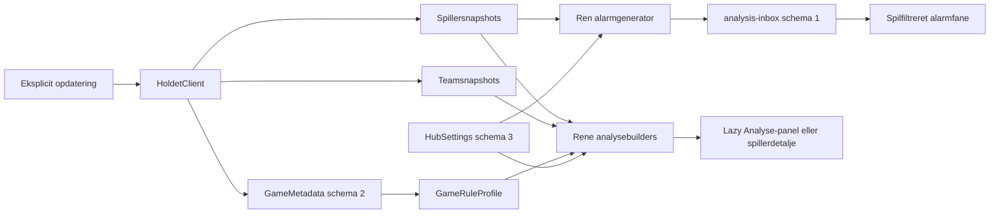

# Analyse- og beslutningscenter

Analysecenteret er en cachebaseret, retrospektiv beslutningsstøtte. Det findes som den ottende managerspilsfane **Analyse** og har panelerne **Beslutninger**, **Gruppe**, **Idealhold** og **Eksperimentel**. Kun det valgte panel beregnes. Navigation læser lokale snapshots og stores; netværk og persistente writes kræver fortsat et eksplicit opdaterings-, gemme- eller alarmklik.

Resultater er mærket med:

- `final`: alle nødvendige snapshots er afsluttede, og eventuelle sæsonregler er verificeret;
- `preliminary`: beregningen er mulig, men en runde eller modelvalidering er foreløbig;
- `unverified`: nødvendige regler, snapshots eller felter mangler.

Provenance indeholder anvendte runder, stikprøvestørrelse, manglende input og kildetype. Et generisk formatmatch er aldrig tilstrækkelig sæsonevidens.

## Formelkontrakt

| Analyse | Formel og gate |
| --- | --- |
| Historisk vækst pr. aktuel mio. | `total_growth / (value / 1_000_000)`. Kun pengespil; pris `<= 0` eller manglende vækst giver ingen værdi. |
| Form 3/5 | Middel af de seneste præcis 3 eller 5 afsluttede observationer. Et ufuldstændigt vindue giver ingen værdi. Rundehuller interpoleres ikke. |
| Stabilitet | På seneste højst fem afsluttede observationer og mindst tre: `sample_stdev(x)`, `scale=max(mean(abs(x)),1)`, `round(100/(1+dispersion/scale))`. 70–100 er stabil, 40–69 balanceret og under 40 boom/bust. |
| Kaptajn | Faktisk bonus er `RoundSummary.captain_bonus`. Et alternativ summerer `round_change * (multiplier - 1)` for det verificerede kaptajnantal. Scenarier kræver præcis rundetrup og deaktiveres ved mismatch mod den officielle bonus. |
| Bank | For bank `A` og investering `P`: `lost_interest=interest(A)-interest(A-P-fee(P))`; `break_even=fee(P)+lost_interest`; procenten er `break_even/P`. UI viser faktisk og regelberegnet rente samt andelen af spillere, hvis form 3/5 slog grænsen. |
| Transfer | For sammenhængende afsluttede snapshots: `decision_delta=bought_growth-fee-sold_next_growth`; `no_trade=actual_change-decision_delta`. Sæsonsummen er kun summen af et-rundes kontrafaktiske beslutninger. |
| Bedst/værst | Maksimum og minimum af verificerede transferdeltaer. Lighed afgøres af tidligste runde. Kaptajn og bank vises separat. |
| Gruppe/swing | Fælles og unikke spillere sammenlignes med gruppeføreren fra den eksisterende stilling. Afsluttet swing bruger faktisk rundevækst; fremadrettet potentiale er mærket som formbaseret proxy. |
| Eksponering | `ejere / hold_med_dækkende_snapshot`. Dækkede hold, samlet gruppestørrelse og manglende hold vises altid. |
| Pris-/pointkurve | Bruger `PlayerHistoryPoint.value`-semantikken og faktiske rundenumre. Ikke-afsluttede punkter mærkes `preliminary`; en tom numerisk serie giver en forklaring i stedet for en graf. |

## Regel- og datakontrakter

`GameRuleProfile` er bundet til konkret locale og spil-/sæsonslug. En verificeret profil kræver en officiel kilde-URL og adgangsdato. Rente og transfergebyr gemmes som basispoint med en eksplicit `floor`, `ceil` eller `nearest`-afrunding. Budget, trupstørrelse, formation eller kategorier, klubgrænse, kontrakter og kaptajnregler er valgfrie, indtil de er dokumenteret.

`GameMetadata` schema 2 kan indeholde profilens projektion. `TransferRuleProfile` er bevaret som bagudkompatibelt API, men dens generiske formatpresets verificerer ikke en ny sæsons beslutningsanalyse. Schema 1-metadata læses uden startup-write.

Spillernoter og tags, gemte `PlayerStatisticsQuery`-profiler, standardhold og eksperimentelt opt-in ligger i `HubSettings` schema 3. En note er højst 2.000 tegn; en spiller kan have højst 12 normaliserede tags á 24 tegn. Standardtags er `overvej`, `undgå`, `kaptajn` og `langsigtet`, og egne tags er tilladt.

Statusalarmer ligger centralt i `config/analysis-inbox.json` schema 1, men vises filtreret i det relevante managerspil. De oprettes kun af en eksplicit spiller- eller managerspilopdatering, deduplikeres pr. tilstand og runde og kan markeres læst, afvises og ryddes. Rydning fra en managerspilsfane påvirker kun dette spil. Uden et eksplicit kildefelt bruges **fjernet fra spillerlisten**, aldrig **solgt**. Historisk backfill udløser ikke aktuelle alarmer.

## Idealhold

`optimize_ideal_team` er en deterministisk depth-first branch-and-bound-søgning fra standardbiblioteket. Den håndhæver heltalsbudget, trupstørrelse, positioner eller kategorier og klubgrænser. Upper bounds fra de bedste resterende gevinster og lower cost bounds er sikre; ingen heuristisk pruning må fjerne optimum.

Tie-break er højeste rundevækst, laveste pris og derefter leksikografisk sorterede stabile spiller-ID'er. Standardtimeout er fem sekunder, og UI tillader højst 30. Kun `optimal` kaldes **Idealhold**. `timeout` viser bedste fundne trup og et sikkert objektivloft; `infeasible` forklarer, at ingen trup opfylder reglerne. Modulet kræver afsluttet runde, komplet all-player-snapshot og verificerede sæsonregler. Spillere uden `round_growth` ekskluderes med et synligt antal; retrospektive skadeflag ekskluderer ikke.

## Eksperimentelle moduler

Eksperimentelle analyser er slået fra pr. spil, indtil brugeren gemmer et opt-in.

Fixturekontrakten accepterer kun en kilde, som er dokumenteret offentlig uden login og har en parsertest. `FixtureRecord` indeholder runde, hold, modstander, hjemme/ude, starttid og eventuel officiel difficulty. Difficulty vises kun, når både feltet og dets dokumentation er registreret; ellers vises kun kamplisten og **difficulty ikke verificeret**. `FixtureStore` er cache-only ved læsning og skrives kun af en eksplicit fremtidig adapterhandling.

Monte Carlo sammenligner ét gyldigt transferscenarie med ingen handel. Fælles spillere annulleres, og hele observerede rundevækstvektorer reduceres samlet, så den observerede samvariation bevares. Fem dækkende afsluttede runder åbner 10.000 block-bootstrap-simuleringer over tre runder; 3–4 giver kun deskriptiv analyse, og færre end tre blokerer. Manglende værdi kan erstattes af positionsmedian, når mindst tre peers findes i observationen.

Standardseed er de første 64 bit af SHA-256 over kanoniske input. UI viser median, P10/P90, sandsynlighed for at slå baseline, seed og inputdækning. Ved mindst otte runder vises en walk-forward-backtest mod seneste-runde- og 3-runders-gennemsnitsbaselines. Fixtures påvirker ikke simulationen i denne version.

## Dataflow

## Evidensmatrix

| Kontrakt | Implementering | Tests | Ekstern evidensstatus |
| --- | --- | --- | --- |
| Form, stabilitet og vækst pr. mio. | `holdet_lib/decision_analysis.py` | `tests/test_decision_analysis.py` | Snapshotfelter er observerede; ingen sæsonregel kræves. |
| Kaptajn, bank og transfer | `GameRuleProfile`, rene builders | Formel-, mismatch-, rente-, afrundings- og transferhultests | [Holdet.dk](https://www.holdet.dk/da), tilgået 2026-08-07, gav ikke direkte tilstrækkelige konkrete regelsider; registeret er derfor tomt og UI fail-closed. |
| Idealhold | Eksakt DFS branch-and-bound | Brute force, tie-break, timeout, infeasible og cirka 400 kandidater | Aktiveres først efter en auditeret sæsonprofil. |
| Alarmer | `analysis_inbox.py`, refresh-hooks | Transition, deduplikering, persistence, backup/restore og separat spillerfallback | Feltet **solgt** er ikke dokumenteret og produceres ikke. |
| Fixtures | `fixtures.py` | Offentlig-/parsergate, schema og officiel difficulty | [Tourspillet 2026](https://www.holdet.dk/da/fantasy/tour-de-france-2026/landing), tilgået 2026-08-07, dokumenterer ikke et godkendt fixture-/difficultyfelt; ingen adapter er registreret. |
| Monte Carlo | `simulate_transfer_scenario` | Seed, fælles-spiller-annullering, gates, intervaller, dækning og backtest | Intern eksperimentel model; ikke en officiel Holdet-prognose. |
| Cache-only UI | `website/analysis_pages.py`, routing i `website/app.py` | Streamlit AppTest for Analyse-, spiller- og alarmruter | Navigation foretager ingen automatisk hentning eller persistente writes. |

## Begrænsninger

- Beslutningsdeltaet er et lokalt et-rundes kontrafaktisk regnskab, ikke kausal attribution og ikke en rekonstrueret alternativ sæson.
- Form er historisk beskrivende og indeholder ingen modstander-, fixture- eller skadesprognose.
- Monte Carlo genbruger observerede rundemønstre; intervaller er modeloutput, ikke garantier.
- Gruppeeksponering dækker kun hold med et lokalt snapshot. Der foretages ingen automatisk hentning af offentlige opstillinger.
- Nye sæsoner forbliver `unverified`, indtil den officielle regelside er registreret i det auditerede sæsonregister og dækket af test.
