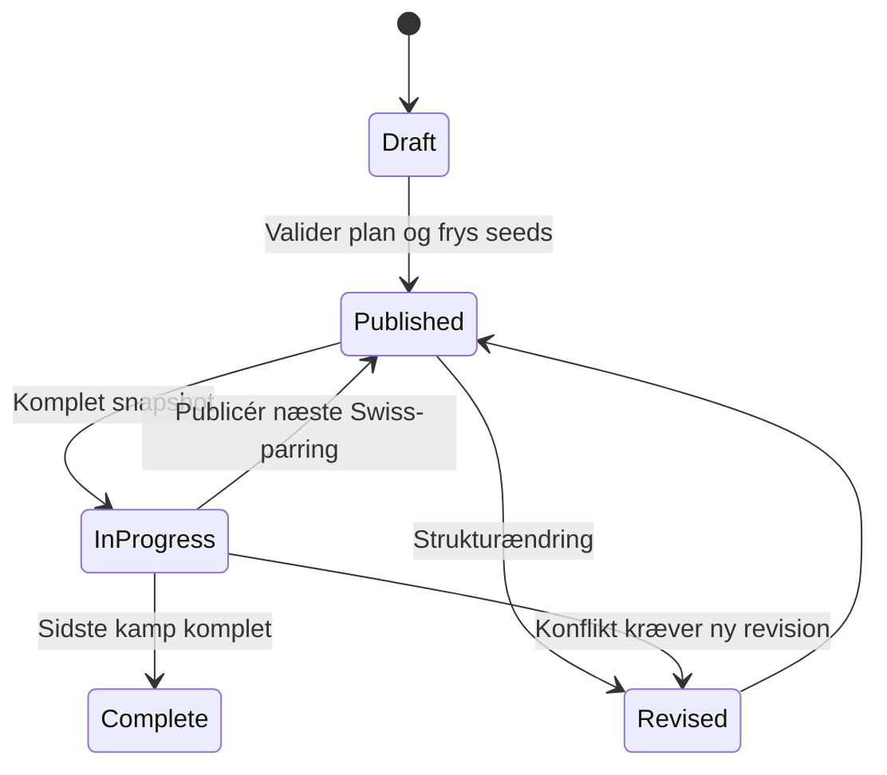

# Grupper og turneringer

Dashboardets hierarki er `Managerspil → Gruppe → Hold`. Et managerspil kan have almindelige gruppestillinger og turneringer side om side.

## Managerspil

Et managerspil identificeres af locale og slug og har et redigerbart navn. Det kan oprettes uden netværk. **Hent spilinfo** gemmer senere officielt navn, schedule, deadlines og autoritativ finalerunde, men overskriver ikke automatisk brugerens navn.

Rundecenter er managerspillets første fane. De øvrige er Grupper, Spillerstatistik, Holdstatistik, Historik, Analyse, Administration og Indstillinger. Managerspillets Historik sammenligner holdtrends og kan filtreres til en gruppe. Analyse er lazy-loadet via query-parameter og beregner kun det valgte panel. Arkivering flytter eller sletter ikke grupper, snapshots, manifester, metadata eller Hall of Fame-resultater.

## Almindelige grupper

En almindelig gruppe har fanerne **Stilling** og **Historik**. Historikken genbruger gruppens managerspil og medlemmer uden nye vælgere og viser værdi/point, rundevækst og grupperang. Manglende runder forbliver huller, og rangaksen vender førsteplads øverst.

Stillingen viser `Rang · Manager · Hold · Værdi · Vækst · Afstand`:

- **Samlet** rangerer efter rundens sluttotal; afstand er forskellen til totallederen.
- **Runde** rangerer efter rundens ændring; afstand er forskellen til rundelederen.

Competition ranking bruges ved ties, og holdnavn er den deterministiske sekundære sortering.

**Analyse → Gruppe** finder gruppeføreren fra den eksisterende stilling i valgt runde og viser fælles spillere, hver sides unikke spillere, afsluttet faktisk swing og en tydeligt mærket formbaseret proxy. Eksponering er antal ejere divideret med hold med dækkende rundesnapshot; UI viser altid dækkede hold, total gruppestørrelse og manglende hold. Der foretages ingen automatisk hentning af opstillinger.

## Turneringsformater

Schema-8-runtimeformatet er fortsat `TournamentConfig`; `TournamentDefinition` er det kompatible offentlige alias. `LeagueTemplateConfig`, `SwissTemplateConfig`, `GroupKnockoutTemplateConfig` og `DoubleEliminationTemplateConfig` er validerede projektioner via `tournament_template_config`. Guiden vælger template, deltagere, fantasy-runder, seedning og tie-breakers og viser en fixture-preview før gem.

| Template | Plan |
| --- | --- |
| `league` | Circle schedule med én eller to indbyrdes kampe |
| `swiss` | Scoregrupper, Buchholz, rematch-undgåelse og fair bye |
| `group_knockout` | Serpentine-grupper, power-of-two-kvalifikation og krydsseedet bracket |
| `double_elimination` | Winners-/losers-bracket, to nederlag og eventuel reset-finale |

Fælles kamppoint er som standard 3/1/0. Stillingen kan derefter bruge `score difference`, `score for`, `head-to-head`, `Buchholz` og `entry seed`; stabilt hold-ID er et skjult sidste reservekriterium. Lige knockoutopgør afgøres af konfigurerede sportslige kriterier og til sidst højere seed.

Seedning kan være tilfældig, manuel eller Elo-baseret. Det konkrete seed-resultat og alle publicerede fixtures fryses på turneringsrevisionen. Senere Elo- eller datakorrektioner ændrer resultater, men aldrig allerede publicerede parringer.

Ligaen bruger circle scheduling og blokerer flere kampe til samme deltager i én fantasy-runde. Swiss bruger som standard `ceil(log2(deltagere))` runder; næste parring må først publiceres efter eksplicit refresh af den foregående komplette runde. En Swiss-turnering kan først afsluttes, når alle konfigurerede runder er publiceret og komplette. Byen går deterministisk til den lavest rangerede deltager uden tidligere bye og tæller som en spillet sejr med turneringens konfigurerede sejrspoint, men først når runden er nået. Liga-byes giver ingen point.

Gruppespil + knockout understøtter 1–8 grupper, serpentine-seedning, gennemførlig kvalifikation og valgfri bronzekamp. Uden bronzekamp bestemmes bronze af den bedst rangerede tabende semifinalist. Double elimination understøtter op til 32 deltagere, byes og en reset-finale, når den ubesejrede finalist taber første finale.

### Revisioner og legacy

Ændring af format, deltagere, seedning, tie-breakers eller rundestruktur opretter en ny revision efter bekræftelse. Navn og officiel URL er kosmetiske og ændrer ikke revisionen. En datakorrektion må genberegne resultater, men en synlig pairing-konflikt kræver en ny revision.

Indlæste Swiss-parringer kontekstvalideres mod gruppe, revision, rundeinterval og deltagere. Dubletter, mere end én bye eller mere end én kamp pr. deltager og runde afvises. Efter datakorrektioner genberegnes den forventede parring som en ren kontrol; en afvigelse vises som konflikt, mens den publicerede parring forbliver uændret.

Schema 1–7 læses som `group_knockout` med én gruppe, eksisterende fixtures og seeds, de tidligere tie-breakers og ingen bronzekamp. Kompatibilitetswrapperne `create_tournament_config` og `build_tournament_state` bevares.

Turneringens faner tilpasses templaten. Overblik, Kampe og Historik bevares; standings og brackets vises kun, når de er relevante.

## Managers og sæsoner

Den globale **Managers**-destination erstatter Hall of Fame som navigationsnavn. Den samler Elo, den eksisterende pointprofil, medaljer, rekorder, H2H, sæsoner og identitetsstyring. Den gamle `?view=hall-of-fame`-route viderestiller fortsat.

Managerens bedste hold pr. spil/runde tæller, og selvopgør fjernes. Komplette managerresultater publiceres som append-only eventrevisioner; navigation viser kun cachebaserede previews. Læs [Managers og sæsoner](managers-and-seasons.md) for identitet, Elo, awards, H2H og sæsonpoint.

## Kalender og officielle links

Kalenderen samler kommende gruppe- og turneringskampe fra lokal schedulemetadata og publicerede fixtures. Mangler tidspunktet, vises eventet separat med link til den eksisterende spilinfohandling. Navigationen henter eller skriver aldrig.

Grupper kan gemme en manuel `official_url` med typen `group` eller `minileague`. URL'en valideres som HTTPS på `www.holdet.dk` med korrekt locale-prefix, uden credentials. Hubben gætter ikke den konkrete grupperute.

## Opdatering

**Opdater managerspil** henter den seneste spillerliste én gang og deduplikerer hold på tværs af grupper. Spiller- og holdfejl rapporteres separat. **Opdater turnering** henter alle deltagere, også eliminerede og afsluttede, så rettelser kan genberegnes. Begge handlinger følger rækkefølgen hent data, publicér højst næste Swiss-runde, genopbyg state og frys komplette events for det aktuelle managerspil. Resultatet gemmes som snapshots og et uforanderligt manifest; delvise fejl bruger seneste gyldige cache, når den findes.

Se [Analyse- og beslutningscenter](decision-analysis.md) for swing-, eksponerings- og provenancekontrakter.
