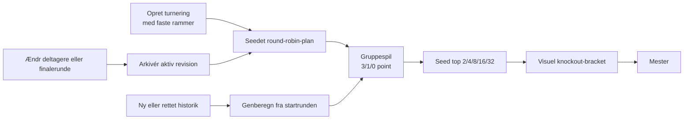

# Grupper og turneringer

Dashboardets hierarki er `Managerspil → Gruppe → Hold`. Et managerspil kan have almindelige gruppestillinger og turneringer side om side.

## Managerspil

Et managerspil identificeres af locale og slug og har et redigerbart navn. Det kan oprettes uden netværk. **Hent spilinfo** gemmer senere officielt navn, schedule, deadlines og autoritativ finalerunde, men overskriver ikke automatisk brugerens navn.

Rundecenter er managerspillets første fane. De øvrige er Grupper, Spillerstatistik, Holdstatistik, Historik, Administration og Indstillinger. Managerspillets Historik sammenligner holdtrends og kan filtreres til en gruppe. Arkivering flytter eller sletter ikke grupper, snapshots, manifester, metadata eller Hall of Fame-resultater.

## Almindelige grupper

En almindelig gruppe har fanerne **Stilling** og **Historik**. Historikken genbruger gruppens managerspil og medlemmer uden nye vælgere og viser værdi/point, rundevækst og grupperang. Manglende runder forbliver huller, og rangaksen vender førsteplads øverst.

Stillingen viser `Rang · Manager · Hold · Værdi · Vækst · Afstand`:

- **Overall** rangerer efter rundens sluttotal; afstand er forskellen til totallederen.
- **Runde** rangerer efter rundens ændring; afstand er forskellen til rundelederen.

Competition ranking bruges ved ties, og holdnavn er den deterministiske sekundære sortering.

## Turneringer

Turneringer har fanerne **Overblik**, **Gruppestilling**, **Kampe**, **Knockout** og **Historik**.

Turneringen kræver mindst to hold, positiv startrunde og én eller to Holdet-runder pr. knockoutopgør. Knockoutfeltet er den største 2-potens, som ikke overstiger deltagerantallet, dog højst 32. Der skal være mindst én gruppespilsrunde.

Circle/round-robin-planen sikrer højst én kamp pr. hold pr. runde. Samme `draw_seed`, medlemmer og rammer giver samme plan. Nye lodtrækninger får et nyt seed og undgår kendte plan-signaturer, når alternativer findes.

En kamp giver kun point, når begge rundesammendrag er `complete`. Sejr giver 3, uafgjort 1 og nederlag 0. `in_progress`, `unknown` eller manglende data efterlader kampen afventende.

Seedning afgøres af point, samlet rundevækst-forskel, scoret rundevækst, indbyrdes point og til sidst holdnavn/ID. To-runders knockout summerer runderne; ved lighed går højeste seed videre.

### Visuel bracket

Knockout viser et responsivt, horisontalt CSS-grid med seed, deltagere, score, runde, vinder, kommende kampe og pladsholdere for senere stadier. Den bruger sanitiseret `st.html` uden JavaScript. Før gruppespillet er færdigt mærkes seeds som foreløbige. En holdvælger fremhæver holdets aktuelle eller mulige vej til finalen.

Turneringen genberegnes fra nyeste gyldige snapshots. Deltager- eller finalerundeændringer arkiverer den aktive plan som en uforanderlig revision; en ren navneændring gør ikke. Under Kampe kan to deltagere sammenlignes i H2H til og med valgt runde.

## Global Hall of Fame

Hall of Fame er en selvstændig destination på samme nederste navigationsniveau som Data og lager. Den samler resultater på tværs af alle grupper, turneringer, spil og sæsoner.

Manageridentitet findes i rækkefølgen `owner_user_id`, `account_user_id`/kontonøgle og en tydelig fallback. Aliaser i `hub-settings.json` kan samle identiteter. Har samme manager flere hold i samme konkurrence eller runde, tæller kun det bedste resultat.

Standardprofilen giver:

- gruppeslutstilling top 4: 10/6/3/1;
- turneringsvinder/finalist/tabende semifinalist: 10/6/3;
- global rundesejr: 1.

Turneringsgruppespil og knockout kan begge give point. Pointprofilen kan redigeres og genberegner leaderboardet uden at omskrive frosne råresultater. Visningen indeholder titler, podier, konkurrencesejrsrate, bedste runde og længste rundesejrsstreak.

Live-preview kan ændre sig med cachen. Komplette resultater fryses idempotent efter en eksplicit slutrunde-refresh eller ved arkivering. Ufuldstændigt arkiverede spil bevares uden point og kan færdiggøres efter gendannelse.

## Opdatering

**Opdater managerspil** deduplikerer hold på tværs af grupper. **Opdater turnering** henter alle deltagere, også eliminerede og afsluttede, så rettelser kan genberegnes. Resultatet gemmes som snapshots og et uforanderligt manifest; delvise fejl bruger seneste gyldige cache, når den findes.