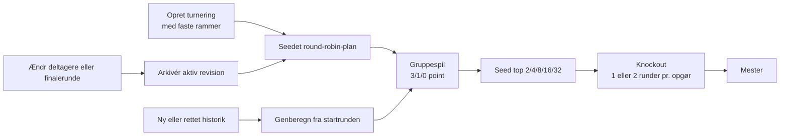

# Grupper og turneringer

Dashboardets hierarki er `Managerspil → Gruppe → Hold`. Et managerspil kan have almindelige gruppestillinger og turneringer side om side.

## Managerspil

Et managerspil identificeres af locale og slug og har et redigerbart visningsnavn. Det kan oprettes fra en Holdet-URL eller en bar slug uden netværkskald. **Hent spilinfo** kan senere hente det officielle navn og den autoritative finalerunde; det officielle navn overskriver aldrig automatisk brugerens navn.

Et managerspil kan arkiveres uden at flytte eller slette grupper, snapshots, manifester eller eksporter. Arkiverede spil er skrivebeskyttede i deres normale visninger og kan gendannes fra managerspillets hovedside.

## Gruppestilling

En Gruppestilling har faste medlemmer, som senere kan tilføjes eller fjernes. Den historiske rundevælger bruger den nuværende medlemsliste og nyeste gyldige rundesammendrag.

Tabellen viser altid `Rang · Manager · Hold · Værdi · Vækst · Afstand`:

- **Overall** rangerer efter round-ending total; afstand er forskellen til totallederen.
- **Runde** rangerer efter rundens ændring; afstand er forskellen til rundelederen.

Competition ranking bruges ved ties, og holdnavn er den deterministiske sekundære sortering.

## Turneringsforløb

### Kalender og felt

Turneringen kræver mindst to hold, en positiv startrunde og én eller to Holdet-runder pr. knockoutopgør. Finalerunden kommer fra Holdets schedule. Knockoutfeltet er den største 2-potens, som ikke overstiger deltagerantallet, dog højst 32. Der skal være mindst én gruppespilsrunde før knockout.

### Lodtrækning

Circle/round-robin-algoritmen sikrer højst én kamp pr. hold pr. Holdet-runde. En hel modstandercyklus gennemføres, før par gentages; ved ulige antal hold fordeles pauser så jævnt som muligt.

Nye planer har et tilfældigt `draw_seed`. Samme seed, samme sorterede medlemmer og samme rammer giver samme plan. **Ny lodtrækning** skaber et nyt seed. Når flere planer er mulige, undgås signaturer fra tilsvarende turneringer og arkiverede revisioner i samme managerspil.

### Resultater og seedning

En gruppespilskamp sammenligner holdenes `RoundSummary.change`, men kun når begge rundesammendrag er mærket `complete`. Sejr giver 3 point, uafgjort 1 og nederlag 0. `in_progress`, `unknown` og manglende rundedata efterlader kampen som afventende uden point, seedning eller knockoutresultat.

Seedning afgøres af:

1. Point.
2. Samlet rundevækst-forskel.
3. Samlet scoret rundevækst.
4. Indbyrdes point blandt fortsat lige hold.
5. Holdnavn og hold-ID.

Knockout bruger standard rekursiv seedning, eksempelvis `1–8`, `4–5`, `2–7`, `3–6` i et top 8-felt. To-runders opgør summerer begge runders vækst. Ved samlet lighed går højeste seed videre.

### Historik, revisioner og H2H

Turneringen genberegnes fra de nyeste gyldige snapshots, så Holdets historiske rettelser kan ændre seedning, bracket og mester. En deltager- eller finalerundeændring arkiverer den aktive plan som en uforanderlig revision og opretter en ny lodtrækning fra den oprindelige startrunde. En ren navneændring opretter ingen revision.

Under **Kampe** kan to deltagere sammenlignes på tværs af gruppespil og knockout til og med valgt runde. En to-runders knockout tæller som to H2H-kampe. Byes tæller ikke, og afventende kampe vises uden at påvirke statistikken.

## Opdatering

**Opdater managerspil** deduplikerer hold på tværs af grupper. En direkte **Opdater turnering** henter alle turneringsdeltagere, også eliminerede og deltagere i en afsluttet turnering, så historiske rettelser kan genberegnes. Resultatet gemmes i snapshots og et uforanderligt manifest; delvise fejl bruger seneste gyldige cache, når den findes.
