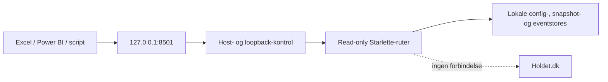

# Lokalt read-only API

`website/server.py` er den kanoniske `st.App`-wrapper omkring den eksisterende `website/app.py`. Wrapperen registrerer API-ruter på samme port; AppTest kan fortsat køre direkte mod `website/app.py`.

OpenAPI-dokumentets `servers`-URL er relativ (`/`). Kontrakten virker derfor uændret, når serveren startes på en tilfældig fri loopback-port i UI-tests eller på standardporten 8501.

```powershell
py -3.14 -m streamlit run .\website\server.py
```

API'et accepterer kun loopback-klienter og `Host`-værdierne `127.0.0.1`, `localhost` eller `::1`. Standardkonfigurationen binder fortsat til `127.0.0.1`. Ruterne læser kun lokale stores, har ingen skriveendpoints, kontakter aldrig Holdet.dk og sender ingen wildcard-CORS-header.

## Ruter

| Rute | Formål |
| --- | --- |
| `GET /api/v1/health` | Status, API-version og read-only/netværkstilstand |
| `GET /api/v1/catalog` | Kolonner, filtre, påkrævede filtre og grænser pr. datasæt |
| `GET /api/v1/openapi.json` | OpenAPI 3.1-kontrakt |
| `GET|HEAD /api/v1/data/{dataset}` | JSON- eller CSV-data |
| `GET|HEAD /downloads/{artifact_id}` | Kun registrerede eksport-/backup-artifacts; aldrig rå filstier |

Datasættene er `games`, `rounds`, `players`, `teams`, `team_history`, `groups`, `group_standings`, `managers`, `seasons`, `season_standings` og `storage_usage`.



## Query-parametre

`format=json|csv`, `limit=1..5000` og `offset>=0` gælder alle dataruter. Catalog angiver de relevante filtre blandt `locale`, `game`, `round`, `team_id`, `group` og `season`. Ukendte, duplikerede eller ugyldige parametre giver en afgrænset JSON-fejl uden stacktrace eller lokal sti.

Rækker sorteres deterministisk før pagination. Svar har `ETag`, `Last-Modified`, `Cache-Control: private, no-cache`, `X-Content-Type-Options`, `X-Frame-Options`, `Referrer-Policy` og `Permissions-Policy`. `If-None-Match` kan give `304 Not Modified`.

## Excel

Vælg **Data → Hent data → Fra internettet** og brug eksempelvis:

```text
http://127.0.0.1:8501/api/v1/data/players?game=super-manager-fall-2026&format=csv&limit=5000
```

`players` kræver `game`. Tilføj `locale=da` og `round=7`, hvis flere scopes eller en bestemt runde skal vælges.

## Power BI / Power Query

```powerquery
let
    Source = Web.Contents(
        "http://127.0.0.1:8501/api/v1/data/storage_usage?format=csv"
    ),
    Csv = Csv.Document(Source, [Delimiter=",", Encoding=65001, QuoteStyle=QuoteStyle.Csv]),
    Headers = Table.PromoteHeaders(Csv, [PromoteAllScalars=true])
in
    Headers
```

Til gruppe- eller sæsonstillinger bruges henholdsvis `group=<group-id>` og `season=<season-id>`. Slå altid den aktuelle kolonne- og filterkontrakt op i `/api/v1/catalog`.

## Egne scripts

```python
from urllib.request import urlopen
import json

with urlopen("http://127.0.0.1:8501/api/v1/data/games?limit=100") as response:
    payload = json.load(response)

for game in payload["rows"]:
    print(game["locale"], game["game"], game["name"])
```

Artifact-downloads oprettes først, når Hubben eksplicit gemmer og registrerer en rapport eller backup. Et artifact-ID holder op med at resolve, hvis filen flyttes, slettes eller ikke længere matcher den registrerede størrelse og SHA-256.
