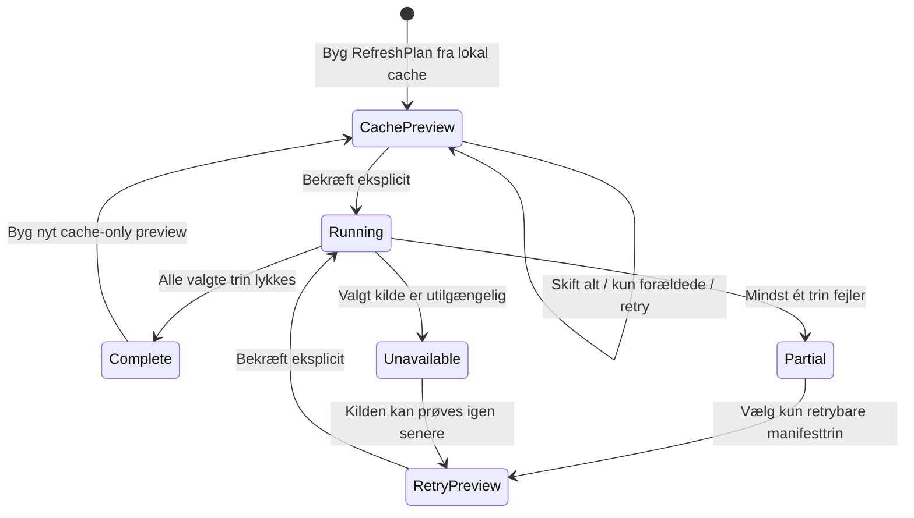

# Rundecenter og daglig arbejdsgang

Rundecenter er startsiden for et managerspil. Det samler næste handling, handelsvindue, datastatus, opdatering, rundeafvigelser, sammenligning, gruppematrix og Rundens historie. Selve overblikket er cache-only: navigation og previews læser lokale snapshots, metadata, alarmer og manifester uden netværk eller vedvarende writes.

## Næste bedste handling og handelsvindue

**Næste bedste handling** er én prioriteret anbefaling med link til den relevante visning:

1. Hent manglende spilmetadata, hvis deadline eller handelsvindue ikke kan verificeres.
2. Opdater forældede eller manglende snapshots.
3. Gennemgå ulæste statusalarmer.
4. Gennemgå holdet, når handelsvinduet er åbent.
5. Vis ingen handling, når der ikke er noget konkret at gøre.

Handelsvinduet vises som **Lukket**, **Åbner om …**, **Åbent** eller **Lukker om …**. Starttidspunktet er inklusivt, mens lukketidspunktet er eksklusivt. Manglende schedulemetadata giver en ikke-verificeret tilstand frem for et gættet tidspunkt.

## Opdaterings-preview, fremdrift og retry

Før et managerspil opdateres, bygger Hubben en `RefreshPlan` fra den eksisterende cache. Previewet viser de valgte datakilder, hvorfor hvert trin er valgt, og hvor mange unikke hold der omtrent bliver hentet. Hold deduplikeres på tværs af grupper. Previewet er et øjebliksbillede: det kontakter ikke Holdet.dk, skriver ikke filer og garanterer ikke, at kilden er uændret ved den efterfølgende kørsel.

Der er tre tilstande:

- **Opdater alt** vælger metadata, spillere og relevante hold.
- **Opdater kun forældede data** vælger manglende data, data der er mindst 24 timer gamle, og data ældre end den senest passerede schedulemilepæl. En afsluttet runde uden bekræftet komplette data er også forældet.
- **Prøv kun fejlede deltrin igen** bygger en ny plan fra det seneste valgte manifest og medtager trin med en retrybar fejl. Når metadata, spillere eller hold genhentes, køres den nødvendige idempotente efterbehandling også igen; øvrige tidligere succeser bæres med som genbrugte resultater.

Efter bekræftelse vises fremdrift pr. datakilde med antal afsluttede trin. Et trin ender som hentet, genbrugt aktuel cache, genbrugt cache efter fejl, fejlet uden cache eller sprunget over som utilgængeligt. En delvis kørsel bevarer gyldig cache og kan danne et nyt retry-preview; den starter aldrig automatisk et nyt netværksforsøg.

## Datastatus og refresh-manifest

En runde kan være aktuel, foreløbig, forældet, manglende, fejlet eller ikke verificeret. **Runde afsluttet, men data bør genhentes** (`completed_needs_refresh`) er en særskilt tilstand: rundens sluttid er passeret, men mindst én kilde mangler, er hentet før afslutningen, er ufuldstændig eller har en nyere fejl. Den er ikke det samme som et endeligt resultat.

`RefreshManifest` schema 2 forklarer den seneste eksplicitte kørsel pr. trin. Det gemmer start/slut, kilde og begrundelse, data- eller cachereference, fejl, metadataændringer samt run- og retryrelationer. UI'et oversætter til:

- **Lykkedes**: nye data blev hentet.
- **Genbrugte cache**: en aktuel cache blev bevidst genbrugt.
- **Fejlede, cache genbrugt**: hentningen fejlede, men en kompatibel cache findes.
- **Fejlede uden cache**: der er intet sikkert fallback.
- **Ikke tilgængelig**: trinnet kunne ikke køres med den kendte kontekst.

Det nye managerspil-refresh skriver schema 2, mens store-laget kan læse både manifest schema 1 og 2. Schema 2 gemmer både et samlet resultat (`complete`, `partial` eller `failed`) og hvert trins oprindelige run-ID, så genbrug og retry kan forklares uden at følge en kæde af filer. Hvis selve manifestskrivningen fejler, bevares det komplette manifest i hukommelsen og kan skrives igen lokalt uden at gentage netværkshentningen. Et schema-1-manifest normaliseres i hukommelsen med `not_recorded` for trin, som det gamle format ikke registrerede, og omskrives ikke ved læsning. Korrupte manifestfiler isoleres med en advarsel, så andre gyldige kørsler fortsat kan vises.

## Rundens afvigelser og sammenligning

**Rundens afvigelser** er én samlet, forklarlig liste med stabile ID'er, gammel/ny værdi og links til berørte hold, når de findes. Den kan indeholde:

- store rangspring;
- nye skader eller statusændringer;
- klubskifter;
- manglende hold eller snapshots;
- ændringer i regler eller schedule fra uforanderlige metadatarevisioner.

Kategori og grænse for store rangspring kan justeres, men lever kun i den aktuelle Streamlit-session og gemmes ikke i brugerindstillinger. Grænsen begrænser kun rangspring; andre valgte afvigelsestyper skjules ikke af den.

Rundesammenligningen viser den valgte runde mod den nærmeste tidligere runde, som findes i lokal cache—eksempelvis runde 3 mod runde 2. Hvis runde 2 mangler, bruges den seneste tidligere tilgængelige runde og betegnes tydeligt. Der hentes eller estimeres ingen manglende værdier.

## Time machine: latest-corrected read-only

Time machine gengiver Rundecenter for en valgt afsluttet runde ud fra de nyeste lokalt tilgængelige, korrigerede fakta. Det er en **latest-corrected read-only** visning, ikke et arkiv af præcis det, brugeren så på et historisk klokkeslæt.

Senere snapshots, metadatarevisioner eller rettede manager-events kan derfor ændre visningen af en gammel runde. Valg af runde foretager ingen fetch, publicerer ingen events og omskriver ingen historik. Manglende historiske fakta vises som manglende eller ikke tilgængelige frem for at blive rekonstrueret ved gæt.

## Gruppematrix

Matrixen viser alle medlemmer i den valgte gruppe med placering, afstand til lederen og næste modstander. For almindelige grupper kommer placering og afstand fra den valgte rundes totaler, og næste modstander vises som **Ingen kampplan**. For turneringer bruges den publicerede turneringsstilling og næste fixture; bye, afventer parring, ikke publiceret, elimineret og afsluttet er særskilte tilstande.

Matrixen følger det valgte gruppe- og rundescope. Manglende hold bliver stående som manglende rækker i stedet for at blive udeladt eller estimeret.

## Rundens historie og delbar HTML

`RoundStory` bevarer sin eksisterende tekst og tilføjer typed `RoundStoryFact`-fakta. Hvert faktum har stabilt `fact_id`, kilderunder, status (`final`, `preliminary` eller `unavailable`), genereringstidspunkt, forklaring, eventuel værdi/enhed og typed referencer til berørte hold. Historien kan derfor forklare rundevinder, føringsskifte, comeback, nærmeste duel og streak ud fra de samme beregnede datapunkter som UI'et.

Den selvstændige HTML-version er escaped, har indlejret CSS, ingen scripts og ingen eksterne assets. Når en holdreference kan valideres, kan den vise to links:

- et HTTPS-link til det korrekte locale og managerspil på Holdet.dk;
- **Åbn i lokal Hub**, når UI'et leverer en fuld URL på `localhost` eller `127.0.0.1`.

Core-biblioteket kender ikke dashboardets routes og modtager derfor allerede byggede lokale URL'er fra UI'et. Lokale Hub-links virker kun, mens Hubben kører. Alle links åbnes med `noopener noreferrer`. Filnavnet er `rundens-historie-<slug>-runde-<N>.html`.

## Relateret dokumentation

- [Klienter](clients.md) beskriver navigation, deeplinks og session state.
- [Datahentning](data-retrieval.md) beskriver HTTP-, cache- og fejlprincipper.
- [Datalagring](data-storage.md) beskriver stier, skemaer og kompatibilitet.
- [Dataportabilitet](data-portability.md) beskriver eksport- og rapportkontrakten.
- [Tests](testing.md) beskriver verifikation og acceptkommandoer.
